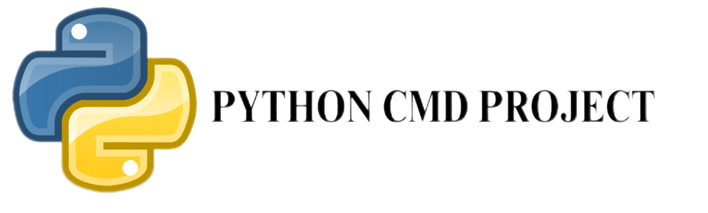

## PYDOS VERSION 2.0 FINAL
Hello, welcome to Readme
Pydos is a Python command line that does things
like: convert code, edit code, find IP, get IP, etc. 
We are going to stop the project until November.
## Updates
- 1: **ADDED NEW COMMAND(MV, CAT, TOUCH, PARTEST, RESET)**
- 2: **UPDATED SETUP PROGRESS***
- 3: **ADDED LOGIN SCREEN**
- 4: **REMOVED ALL OLD BANNER AND ADDED NEW BANNER**
- 5: **RENAMED DEV FOLDER ---> LOSK**
- 6: **UPDATED BOOT.PY ---> XC-GRUB BOOTLOADER**
- 7: **UPDATED HELP, DASH, CALC COMMAND**
## Warnings
WARNING: It's just a simple Python program, not an operating system
## Contact us
- Telegram ID: @t7280h
## How to install Pydos
**Create a Folder for Pydos setup**
```bash
mkdir <folder>
```
**Download Pydos From GitHub**
```bash
git clone https://github.com/T7280H/pydos2-0
```
**Enter the installation folder**
```bash
cd pydos2-0/installation
```
**Start the Setup**
```python
python install.py
```
## License
```mit
MIT License

Copyright (c) 2025 T7280H

Permission is hereby granted, free of charge, to any person obtaining a copy
of this software and associated documentation files (the "Software"), to deal
in the Software without restriction, including without limitation the rights
to use, copy, modify, merge, publish, distribute, sublicense, and/or sell
copies of the Software, and to permit persons to whom the Software is
furnished to do so, subject to the following conditions:

The above copyright notice and this permission notice shall be included in all
copies or substantial portions of the Software.

THE SOFTWARE IS PROVIDED "AS IS", WITHOUT WARRANTY OF ANY KIND, EXPRESS OR
IMPLIED, INCLUDING BUT NOT LIMITED TO THE WARRANTIES OF MERCHANTABILITY,
FITNESS FOR A PARTICULAR PURPOSE AND NONINFRINGEMENT. IN NO EVENT SHALL THE
AUTHORS OR COPYRIGHT HOLDERS BE LIABLE FOR ANY CLAIM, DAMAGES OR OTHER
LIABILITY, WHETHER IN AN ACTION OF CONTRACT, TORT OR OTHERWISE, ARISING FROM,
OUT OF OR IN CONNECTION WITH THE SOFTWARE OR THE USE OR OTHER DEALINGS IN THE
SOFTWARE.
```

